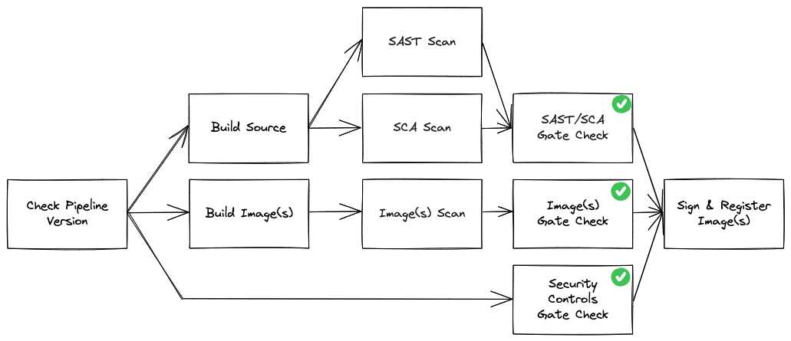
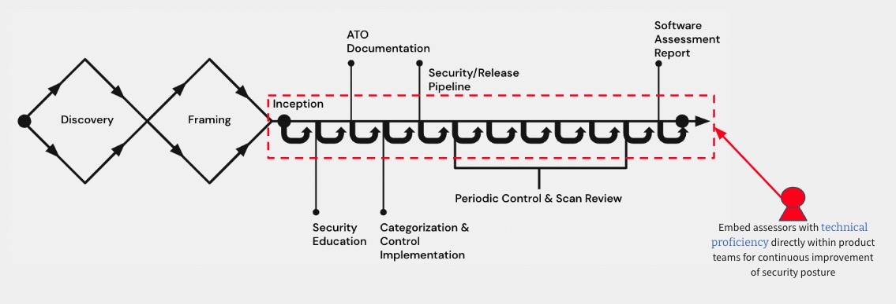

# Overview

xxx

 

# People

xxx

 

# Integrated Process & Technology

xxx

 

## Prepare (zero-based review)

xxx

 

## Categorize

xxx

 

## Select

xxx

 

## Implement

xxx

 

## Assess

xxx

 

## Initial Authorization

xxx

 

## Monitor

xxx

 

## Ongoing Authorization

xxx

 

# High Level Approach

This page currently covers a brief description of approaches made to support establishing an Ongoing Authorization and continuous Authority to Operate (cATO) for systems that are deploying onto a given platform.

- [Architecture Inheritance Model](#architecture-inheritance-model)
- [Ongoing Authorization Boundary](#ongoing-authorization-boundary)
- [Secure Release Pipeline Capabilities](#secure-release-pipeline-capabilities)
- [Security Control Assessors](#security-control-assessors)

 

## Architecture Inheritance Model
We leverage a modern architecture that allows us to build, deploy and monitor our systems. This is also the foundation to supporting a common control inheritance model through [common control providers](https://csrc.nist.gov/glossary/term/common_control_provider#:~:text=Definition(s)%3A,controls%20inherited%20by%20information%20systems). At the lowest level, a cloud environment serves as our infrastructure and provides flexible compute and storage capabilities. Above that is a modern platform which leverages this infrastructure to provide both operating environments, as well as a secure mechanism for shipping applications. The cloud environment, the platform, and the secure release pipeline account for a percentage of NIST 800-53 Controls that are solely owned by each layer of the stack. This means that System Owning teams benefit in having an overall reduction in effort and responsibility for NIST 800-53 Controls that are addressed from the other layers in the stack, when shipping software onto the platform.

 

 

## Ongoing Authorization Boundary
The platform's Ongoing Authorization Boundary (also known as the *Accountability Boundary*) and approach to performing cATO covers the platform, secure release pipeline, custom applications deployed onto the platform, as well as any Commercial Off The Shelf (COTS) software that supports the operations of the platform or secure release pipeline (e.g. authentication services and security vulnerability scanning tools). All COTS software that is SaaS-based must complete the necessary accreditation for Federal Risk and Authorization Management Program (FedRAMP).

 

 

## Secure Release Pipeline Capabilities
[Continuous Integration](https://www.martinfowler.com/articles/continuousIntegration.html) (CI) pipelines ensure that System Owning teams can deliver frequent changes of software into production quickly and safely. On a development platform, app teams have the flexibility to build, test and deploy using whatever strategy is best suited for their system. However, before teams can deploy to the platform, they must be registered to and call the secure release pipeline. 

This pipeline service should only be available to software development teams that are customers of your platform. A strong secure and release pipeline enables security vulnerability detection and remediation guidance every time an engineer commits code changes to their repository. At a minimum, your pipelines should provide immediate feedback on security vulnerabilities for Static Application Security Testing (SAST), Software Composition Analysis (SCA) for open source packages, as well as vulnerabilities that exist within Image(s)/Container(s). The secure release pipeline enforces [policies](policy.md) as gatecheck jobs, that must be adhered to in order for teams to achieve a [digitally signed](https://csrc.nist.gov/glossary/term/digital_signature) application image. Only images signed by your secure release pipeline should be allowed onto the platform, and are validated by the platform prior to upper environment deployments.

 

 

## Security Control Assessors
If you recall the [RMF Structure](overview.md#rmf-structure), there are two major steps of NIST RMF known as Assess and Authorize. At a high level, the Assess step is focused on having a third party Secuirty Control Assessor (SCA) create what is called a Software Security Plan (SSP) that will be used to assess how the System Owning team, implemented controls that were established during earlier steps of the RMF process. Assessors can then provide a Security Assessment Report (SAR) to the team and AO regarding the outcomes of their assessment. This report provides findings and recommendations on deficiencies related to security risks. Deficiencies are either addressed before acquiring an ATO approval from an AO, or listed as a Plan of Action and Milestone (POA&M) that will be addressed within a specified time period after acquiring an ATO approval, and deploying to production.

Traditionally, System Owning teams would coordinate a week, or multi-week long assessment exercise, months in advance to provide adequate time to address NIST Controls and outcomes of the assessment. This forces teams to operate with a waterfall schedule mentality, taking on coordination risks, and planning around the availability of Assessors as well as the actual readiness of the system for assessment. This typically adds months of delay to a teams path to production, focuses on an incomplte picture of known risks, and often leads to a large list of unaddressed POA&Ms that then have long shelf lives before being mitigated.

Our approach is aimed at aligning NIST RMF steps and practices to how modern software development teams actually develop and deliver systems to end-users - iteratively and incrementally. As denoted by the image below, teams learn enough about the problem space, the end-users they are solving for, the data and types of technology that will be used to deliver the end results. It is at this point when a SCA is embedded with the team throughout the lifecycle of their system and Software Development Lifecycle (SDLC). We also employ a solution known as [SD Elements](https://www.securitycompass.com/sdelements/) which allows the System Owning team, Assessors and other RMF roles to create a detailed threat models using both surveys and diagrams to drive[Risk Categorization](categorization.md), [Control Selection](selection.md), Control Implementation, and Control Assessment activities. This process of assessing risks and verifying that requirements have been met, occurs as changes are introduced by the System Owning team or system dependencies. By iteratively and incrementally addressing small amounts of security risks, Assessors and System Owning teams have greater transparency and trust in the process of certifying the system to go to production.

 

 
