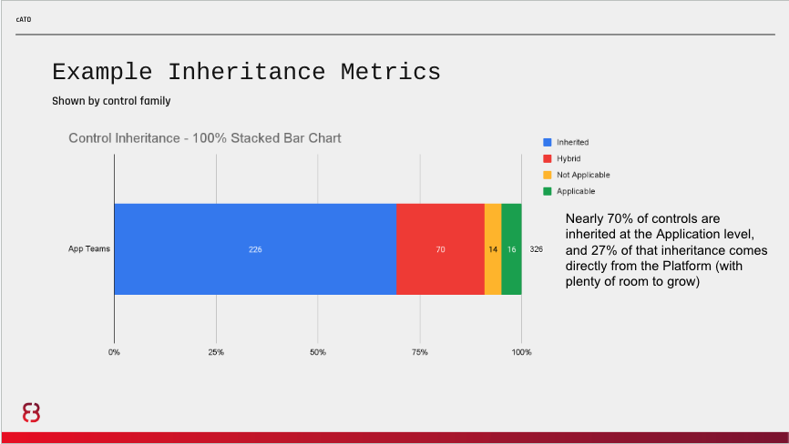
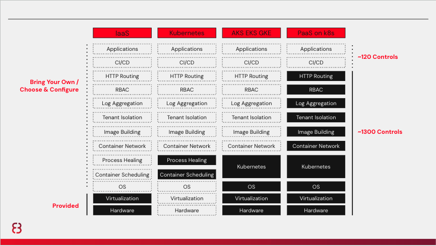

# Prepare (for a zero-based review)

Use the Prepare step to align all stakeholders to go on a journey towards ongoing authorization strategy using people, process, and technology to achieve near real-time continuous monitoring of controls and cybersecurity.

## Communication Strategy and Plan

It is important to develop a communications strategy with your team and relevant stakeholders. Key points to emphasize in your communications strategy are:

- RMF is our common denominator, start there
- Discuss real concerns, don’t generalize
- Compare outcomes, not intentions vs. outcomes
- Afford us the ability to experiment and create a better process

## Resources

It is important to emphasize with your stakeholders that you will be following NIST SP 800-37, Revision 2 to the letter. If you aren’t an expert, now’s the time to read up.  If you know up front that local policy is more restrictive than RMF and that you may require an exception to policy, now is the time to ask for it while emphasizing that the agency will still meet all FISMA requirements. Be sure to clearly communicate that no matter the destination, you will be starting with an initial authorization to operate, which involves a full zero-based review. We also like to make a promise to our stakeholders, documented formally, that they will have higher quality documentation that is always up to date, with more transparency, more traceability, more auditability, more frequent monitoring, and most importantly, better security and privacy outcomes. We can deliver on this promise!

For cATO, this playbook is a great resource to share, and we highly recommend watching [this video](https://www.rise8.us/resources/continuous-delivery-for-nist-rmf-cato) along with all your stakeholders as a starting point.

For general RMF knowledge, we highly recommend this [RMF Introductory Course](https://csrc.nist.gov/Projects/risk-management/rmf-course) and, again, a thorough study of [NIST SP 800-37, Revision 2](https://csrc.nist.gov/publications/detail/sp/800-37/rev-2/final). The [NIST RMF Website](https://csrc.nist.gov/projects/risk-management) also has other great resources and the NIST documentation is incredibly well-written, organized, and useful.

## Common Controls Inheritance

We also recommend presenting your plan for maximizing common control inheritance. Common control inheritance is a critical enabler at the intersection of process and technology. As noted in the policy section, “software elements are included in authorization boundaries, either as part of the information system on which the software is hosted or as a part of an application-only system or subsystem that inherits controls from the hosting system.” The more controls that applications can inherit, the lower the burden on each application team, and the lower the burden on assessors who only have to assess inherited controls once.

We recommend that you leverage a modern architecture that allows you to build, deploy, and monitor application systems. This is also the foundation to supporting a common control inheritance model through [common control providers](https://csrc.nist.gov/glossary/term/common_control_provider#:~:text=Definition(s)%3A,controls%20inherited%20by%20information%20systems). At the lowest level, a cloud environment serves as our infrastructure and provides flexible compute and storage capabilities. Above that is a modern platform which leverages this infrastructure to provide both operating environments, as well as a secure mechanism for shipping applications. The cloud environment, the platform, and the secure release pipeline account for a percentage of NIST 800-53 Controls that are solely owned by each layer of the stack, as shown in the diagram below. This means that System Owning teams benefit in having an overall reduction in effort and responsibility for NIST 800-53 Controls that are addressed from the other layers in the stack, when shipping software onto the platform.

The more structure and opinionation built into the application platform, the more controls it will provide and the lower the cost of your RMF implementation. Because of the reduced overhead, it will also result in significantly higher speed and quality outcomes. To illustrate this, here is an approximation of the inheritability from different architecture decisions:

A highly structured and opinionated platform also reduces the cost of development and operations. Taken together with a lower cost of compliance, it can drastically reduce total cost of ownership for the system while improving software delivery performance to include quality, security, and speed. It is essential to communicate this as well, because many RMF and Program Management Office (PMO) stakeholders will be concerned about potential tradeoffs regarding cost, schedule, and performance.

## Authorization Boundary

The way the authorization boundary is drawn is also incredibly important. For example, if only teams within the mission owner’s purview will be deploying to the platform, and the platform services are not optional, the optimal authorization boundaries would likely be drawn at the infrastructure, platform, and application layers, with the infrastructure and platform receiving a common controls authorization. We will outline a few hypothetical scenarios.

### Scenario 1: All teams/systems are within the Mission Owner’s purview, platform services are not optional for applications

For this scenario, as noted above, we recommend the boundaries be drawn at the infrastructure, platform, and application layers, with the infrastructure and platform receiving a common controls authorization. As ConMon grows in maturity, each should move to an ongoing authorization. Each application deploying to the platform should go through a zero-based review, inheriting all applicable controls from the infrastructure and platform, to receive an initial authorization to operate. Once maturity has been reached in the organization's ongoing authorization journey, these applications should be automatically promoted to an ongoing authorization as well, provided the zero-based review meets pre-defined requirements outlined by the AO.

> [!NOTE]
> The Air Force began using the term Certificate to Field (CtF) which came from Kessel Run’s original partnership with NGA. This term and process do not have a basis in RMF and we recommend moving away from them.

### Scenario 2: All teams/systems are within the Mission Owner’s purview, platform services are optional for applications

In the case that platform/infrastructure services are optional, meaning application teams are not forced to consume them via API or otherwise, then the infrastructure and platform authorization boundaries need to be broken down into components according to how they are consumed. Usually this means drawing boundaries at the API level. This way, applications only inherit controls for services they are consuming. While this can be tracked by exception at the platform and/or application layer, we find that with the right automation it is a much better experience for developers, assessors, and auditors to issue common controls authorizations in a more granular way to promote modularity and composability. It improves speed, reduces errors, and improves transparency, traceability, and auditability. This is especially true during Day 2 operations as the infrastructure and platform teams patch and upgrade existing services and deliver new ones, which creates cascading effects up the tech stack.

### Scenario 3: Not all teams/systems are within the Mission Owner’s purview

An example of this scenario would be if enterprise cloud organizationally belonged to one mission owner AO (e.g. Enterprise IT AO) and they allowed other mission owners to use their infrastructure to deploy and operate platform and/or application services (e.g. Intelligence Analysis Product Line, Mission Planning Product Line, etc). This would also apply if the platform services were under the purview of the former and only applications were deployed and operated by other Mission Owner AOs.

In this case, we recommend that consuming Mission Owner AOs review the common controls authorizations from the providing Mission Owner AO and grant an Ongoing Authorization to Use, taking note of any risks being inherited and accepted. Then the consumer must follow the same processes above for any platform services and/or applications they deploy and operate. This can be difficult from a cultural and psychological perspective. For instance, many times the enterprise service provider will want to weigh in on what is being deployed on their enabling system.

To help with this, we recommend formalizing a Shared Responsibility Model using best practices from the commercial cloud providers. In this, both Authorizing Officials will sign a document that explicitly lays out the responsibilities of each Mission Owner, including shared responsibilities. This overlap is where the consumer will need to accept any risk, or put in requirements for future consideration. It is also where the provider will exert requirements on the consumer, such as the use of an enterprise secure release pipeline that blocks critical findings or runtime scanning of containers and an SLA for remediation. This must be a negotiation between the provider and consumers, and usually the provider will exert more influence as they have to meet the needs of an entire enterprise.

## Tools and Automation

This is also a good time to present any tools and automation to be used for both digitization of documentation and workflows and their subsequent automation. This is especially important if you elect not to use the enterprise’s preferred GRC platform, such as eMASS or XACTA. FISMA and RMF do not mandate any tools, though an exception to policy may be required at some level of your organization if these solutions have been mandated.
